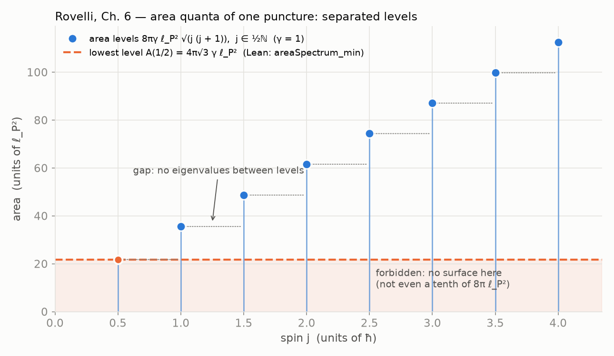
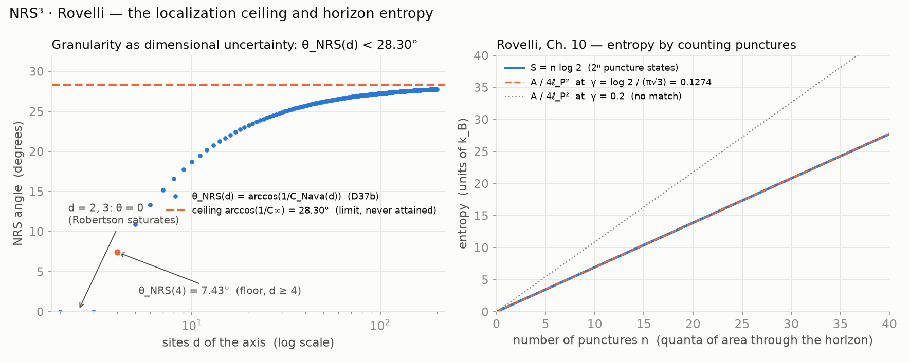

# NRS³ · Rovelli — Loop Quantum Gravity

**Rovelli's quantum granularity, read as dimensional uncertainty: the LQG area spectrum has a
lowest quantum and no fractions of it, horizon entropy by counting punctures fixes the Immirzi
parameter, and the NRS angle `θ_NRS(d)` stays strictly below the ceiling
`arccos(1/C∞) ≈ 28.30°`, which is a limit, never a state.** Lean 4, no axioms.

**[▶ Try it: area quanta vs the localization ceiling][pages]**

Source text: Carlo Rovelli, *La realidad no es lo que parece* (2017) — Ch. 5 (quantum
space-time), Ch. 6 (*Cuantos de espacio*: spin networks, discrete area spectrum
`8 π γ ℓ_P² √(j (j + 1))` with `j ∈ ½ ℕ`), Ch. 10 (black holes: each loop through the horizon
is one quantum of area; entropy by counting punctures).

## Results

| Statement | Lean |
|---|---|
| area spectrum `A(j) = 8 π γ ℓ_P² √(j (j + 1))`, Immirzi `γ` generic | `areaSpectrum` |
| separated levels: `γ ℓ_P² > 0`, `0 ≤ j < k` gives `A(j) < A(k)` | `areaSpectrum_strictMono` |
| lowest level `A(1/2) = 4 π √3 γ ℓ_P²` | `areaSpectrum_half` |
| `A(1/2) ≤ A(j)` for every spin `j ≥ 1/2` | `areaSpectrum_min` |
| `n` punctures of spin `≥ 1/2` have area `≥ n · A(1/2)` | `surfaceArea_ge` |
| entropy of `n` spin-`j` punctures `= log (2 j + 1)ⁿ`, additive | `punctureEntropy_eq_log_card`, `punctureEntropy_add` |
| at spin `1/2`, `S = (log 2 / A(1/2)) · A` | `entropy_proportional_to_area` |
| `S = A / (4 ℓ_P²)` iff `γ = log 2 / (π √3) ≈ 0.1274` | `bekensteinHawking_iff_immirzi` |
| `θ_NRS(4) ≤ θ_NRS(d) < arccos(1/C∞)` for `d ≥ 4` | `angle_lt_ceiling` |
| `θ_NRS(d) → arccos(1/C∞)`; it is the supremum and no `d` attains it | `tendsto_angle_ceiling`, `ceiling_isLUB`, `ceiling_not_attained` |

The ceiling results are theorems of the base repository (`D37b` NRS angle, `D8` Szegő
limit), imported and restated here, not declared. `Verification/Axioms.lean` prints only
`propext`, `Classical.choice` and `Quot.sound` for every result.

## Figures

Interactive page: [naype888-cloud.github.io/nrs3-rovelli-lqg][pages]
(sliders for the spin `j` and the number of sites `d`, vanilla JS, no dependencies).
Generated by `docs/simulation/figures_rovelli.py` (`python3 docs/simulation/figures_rovelli.py`);
the figures use `γ = 1`, `ℓ_P = 1` for the spectrum and the exact closed form of `C_Nava(d)`
(`D8`) for the angle.

[pages]: https://naype888-cloud.github.io/nrs3-rovelli-lqg/





## Scope

What is proved here is mathematics: the LQG area spectrum and puncture counting as stated
(`AreaSpectrum`, `PunctureEntropy`) and the NRS³ ceiling restated from the base repository
(`Ceiling`). The NRS³ core is the base repository; it does not depend on this one. The
readings below that connect LQG with NRS³ — granularity as dimensional uncertainty, the
graviton at the ceiling — are **proposals**, not results of NRS³: developing them is work for
quantum information and quantum gravity, not a claim of this series.

## In NRS³ (proposal)

1. **Granularity = dimensional uncertainty.** The granularity of space in LQG is read as the
dimensional uncertainty of the transport pair `(T_d, P_d)` on `T_d:P_d`, measured by
`θ_NRS(d) = arccos(1/C_Nava(d))`: `0` for `d = 2, 3` (Robertson saturates),
`θ_NRS(4) = 7.43°`, and strictly below `arccos(1/C∞) ≈ 28.30°` for every `d`.
2. **Area quanta.** Every puncture carries at least the lowest quantum `A(1/2)`, so no surface
holds a fraction of it, and the entropy is linear in the number of punctures — the same
shape as the entropy of a cut in `nrs3-defect-curvature`, linear in its δ∞ quanta (a reading;
this repository does not identify the two counts).
3. **The graviton.** The maximally localized excitation has no finite-`d` state at the
ceiling: `arccos(1/C∞)` is approached as `d → ∞` and never reached (`D37b`, `D8`).

## Build

Lean 4 `v4.34.0`, Mathlib `v4.34.0` through the base repository.

```bash
lake exe cache get
lake build
lake env lean Verification/Axioms.lean   # only propext, Classical.choice, Quot.sound
```

Every file: no `sorry`, no `axiom`, `autoImplicit = false`, lines of at most 100 characters,
English headers.

## Timeline 1911–1945

NRS answers a question of the Solvay era with later tools. The series is placed in that window:
what falls inside it is the history the theorem belongs to; what falls after it is a proposal,
not part of NRS³.

| Year | Event | Repository |
|---|---|---|
| 1911 | First Solvay conference: radiation and the quanta | |
| 1911–12 | Poincaré: Planck's law forces discrete levels | [`nrs3-poincare`](https://github.com/naype888-cloud/nrs3-poincare) |
| 1915–20 | Szegő: limit theorems for Toeplitz matrices (the limit `C∞`, `D8`) | [base repository (NRS, NRS³)](https://github.com/naype888-cloud/nava-robertson-schrodinger) |
| 1925–27 | Pauli: exclusion, shells `2n²`, spin matrices | [`nrs3-pauli-dirac`](https://github.com/naype888-cloud/nrs3-pauli-dirac) |
| 1927 | Heisenberg's relation; fifth Solvay conference: electrons and photons | |
| 1928 | Dirac: the `4 × 4` gamma matrices | [`nrs3-pauli-dirac`](https://github.com/naype888-cloud/nrs3-pauli-dirac) |
| **1929–30** | **Robertson and Schrödinger: the uncertainty inequality** | **[base repository (NRS, NRS³)](https://github.com/naype888-cloud/nava-robertson-schrodinger)** |
| 1945–46 | Mandelstam–Tamm: the time–energy bound; Rao (1945), Cramér (1946) | [`nrs3-mandelstam-tamm-cramer-rao`](https://github.com/naype888-cloud/nrs3-mandelstam-tamm-cramer-rao) |

**Tools from after the window.** Niven (1956: rational values of the trigonometric functions),
Fiedler (1973: algebraic connectivity), Lean 4 and Mathlib (the verification). The question is
of 1929; the tools are later; the checking is of 2026.

**After the window: proposals, not NRS³.** [`nrs3-penrose`](https://github.com/naype888-cloud/nrs3-penrose) (Penrose 1996, gravity-related
collapse) and **[`nrs3-rovelli-lqg`](https://github.com/naype888-cloud/nrs3-rovelli-lqg)** (this one) (loop quantum gravity, area spectrum 1995). They use NRS³ results
but their physical readings belong to quantum information and quantum gravity.
[`nrs3-defect-curvature`](https://github.com/naype888-cloud/nrs3-defect-curvature) restates base theorems (`D16`–`D16i`); its Bekenstein–Hawking (1973–75) reading
is a declared bridge.

## The mosaic

- [NRS and NRS³ — the base theorem](https://github.com/naype888-cloud/nava-robertson-schrodinger)
- [NRS³ · Mandelstam–Tamm / Cramér–Rao][nrs3-mt-cr]
- [NRS³ · Penrose](https://github.com/naype888-cloud/nrs3-penrose) (proposal)
- [NRS³ · Pauli–Dirac](https://github.com/naype888-cloud/nrs3-pauli-dirac)
- [NRS³ · Poincaré](https://github.com/naype888-cloud/nrs3-poincare)
- [NRS³ · Defect and curvature](https://github.com/naype888-cloud/nrs3-defect-curvature)
- **[NRS³ · Rovelli — Loop Quantum Gravity][this-repo]**
  (this one)

[this-repo]: https://github.com/naype888-cloud/nrs3-rovelli-lqg
[nrs3-mt-cr]: https://github.com/naype888-cloud/nrs3-mandelstam-tamm-cramer-rao

## License

NRS Noncommercial License 1.0.0, see [`LICENSE`](LICENSE). Author: Eduardo Nava-Hernandez.
